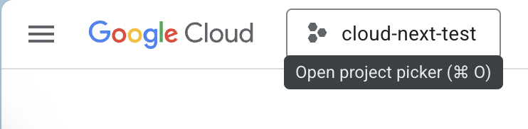
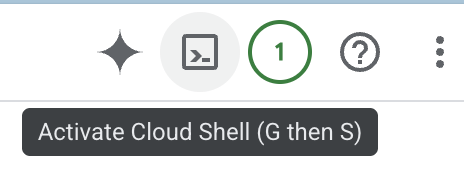

# 🧠 Agent Development Kit (ADK) - Google Cloud Lab

A hands-on guide to building, testing, and running AI agents using Google Cloud’s **Agent Development Kit (ADK)**. You’ll explore single- and multi-agent workflows, and run agents via CLI, script, and web UI.

---

## 📌 Overview

[ADK](https://google.github.io/adk-docs/) is a high-level framework for building agentic applications with built-in support for:

- **Multi-Agent Systems**: Compose modular, hierarchical workflows.
- **Rich Tool Ecosystem**: Use or integrate tools (Google Search, LangChain, CrewAI, etc).
- **Flexible Orchestration**: Sequential, parallel, loop agents, and dynamic LLM-driven routing.
- **Integrated Dev Experience**: CLI + Dev UI for step-by-step testing.
- **Built-in Evaluation**: Track performance and reasoning.
- **Deployment Ready**: Run locally, on Vertex AI Agent Engine, Cloud Run, or Docker.

---

## 🎯 Lab Objectives

You will learn to:

- Understand ADK's core concepts.
- Structure agent directories.
- Configure agents and tools (e.g. Google Search).
- Use `.env` for project/environment setup.
- Run agents via Dev UI, CLI, and programmatically.
- Preview a multi-agent system.

---

## 🛠️ Setup & Requirements

### Prerequisites

- Use your web browser and access to [https://console.cloud.google.com/](https://console.cloud.google.com/)

- Login to Google Cloud Console if you haven't done so.

- Select your project in the top right corner of the console.

## 

- Make sure **Vertex AI API** is enabled in your project, [enable](https://console.cloud.google.com/flows/enableapi?apiid=aiplatform.googleapis.com) it if not.

## 🖥️ Environment Setup

### 1. Open Cloud Shell Editor



> Close Gemini/tutorial panels for more space.

### 2. Clone sample project

```bash
git clone https://github.com/thanhsm/cloudnext-demo-2025.git
cd cloudnext-demo-2025
```

### 3. Install ADK and other dependencies

Follow the detailed installation guide in [ADK documentation](https://google.github.io/adk-docs/get-started/installation):

- We recommend creating a virtual Python environment for this codelab:

```bash
python3 -m venv .venv
source .venv/bin/activate
```

- Install ADK:

```bash
pip install google-adk
```

Install some required dependencies for this codelab:

```bash
sudo python3 -m pip install -r requirements.txt
```

### 4. Open Shell Editor

Open Shell Editor using command:

```bash
cloudshell workspace ~
```

Or select **Open Editor** in Cloud Shell toolbar to open Editor

---

## 📁 Project Structure

```
cloudnext-demo-2025/
├── my_google_search_agent/
│   ├── agent.py
│   └── __init__.py
├── app_agent/
│   └── agent.py
├── llm_auditor/
│   ├── agent.py
│   ├── sub_agents/
│       ├── critic_agent/
│       ├── reviser_agent/
```

Each subdirectory = one agent.

---

## 🧪 Task 1: Run via Dev UI

### 1. Configure `.env`

Create `.env` file in `my_google_search_agent` directory and add following variables:

```env
GOOGLE_GENAI_USE_VERTEXAI=TRUE
GOOGLE_CLOUD_PROJECT=<<REPLACE_WITH_YOUR_GCP_PROJECT_ID>>
GOOGLE_CLOUD_LOCATION=<<REPLACE_WITH_YOUR_GCP_LOCATION>> // e.g. us-central1
MODEL=gemini-2.0-flash-001
```

### 2. Launch Dev UI

Open Terminal and run command:

```bash
cd ~/cloudnext-demo-2025
adk web
```

Open [http://127.0.0.1:8000](http://127.0.0.1:8000) in your browser and select `my_google_search_agent`.

Try:

```
hello
What is some recent global news?
```

> View `grounding_metadata` and search suggestions.

> If you have issues with Port 8000 being used by another process, you can try to use a different port by running:
>
> ```bash
> adk web --port <PORT_NUMBER>
> ```

---

## ⚙️ Task 2: Run Programmatically

### Set environment variables:

```bash
export GOOGLE_GENAI_USE_VERTEXAI=TRUE
export GOOGLE_CLOUD_PROJECT=REPLACE_WITH_YOUR_GCP_PROJECT_ID
export GOOGLE_CLOUD_LOCATION=REPLACE_WITH_YOUR_GCP_LOCATION
export MODEL=gemini-2.0-flash-001
```

### Run script

```bash
python3 app_agent/agent.py
```

### Define Output Schema

In `app_agent/agent.py`:

```python
from pydantic import BaseModel, Field

class CountryCapital(BaseModel):
    capital: str = Field(description="A country's capital.")

# Add to Agent()
output_schema=CountryCapital,
disallow_transfer_to_parent=True,
disallow_transfer_to_peers=True,
```

Run again:

```bash
python3 app_agent/agent.py
```

---

## 💬 Task 3: Run via CLI

```bash
adk run my_google_search_agent
```

Example prompt:

```
What is GDG Vietnam?
```

---

## 🧠 Task 4: Multi-Agent Example

### Agent: `llm_auditor`

Structure:

- `llm_auditor` (SequentialAgent)

  - `critic_agent`
  - `reviser_agent`

### Configure `.env`:

```bash
cat << EOF > llm_auditor/.env
GOOGLE_GENAI_USE_VERTEXAI=TRUE
GOOGLE_CLOUD_PROJECT=REPLACE_WITH_YOUR_GCP_PROJECT_ID
GOOGLE_CLOUD_LOCATION=REPLACE_WITH_YOUR_GCP_LOCATION
MODEL=gemini-2.0-flash-001
EOF
```

### Launch:

```bash
cd ~/cloudnext-demo-2025
adk web
```

Open [http://127.0.0.1:8000](http://127.0.0.1:8000) in your browser and select `llm_auditor`.

Start conversation:

```
Double check this: Earth is further away from the Sun than Mars.
```

Inspect event flow and agent graph.

---

## 🧠 ADK Core Concepts

| Concept             | Description                                 |
| ------------------- | ------------------------------------------- |
| **Agent**           | Core unit that reasons, plans, and acts.    |
| **Tool**            | Extend agent ability (e.g., Google Search). |
| **Session Service** | Tracks state, memory, and history.          |
| **Callbacks**       | Custom hooks in agent lifecycle.            |
| **Artifacts**       | File or binary exchange mechanism.          |
| **Runner**          | Manages execution and coordination.         |

---

## ✅ Summary

In this lab, you learned how to:

- Install and run ADK in Cloud Shell.
- Explore core concepts and tools.
- Build, run, and test agents (Dev UI, CLI, programmatically).
- Set up `.env`, schemas, and tools.
- Run a multi-agent system with real-world capabilities.

---
